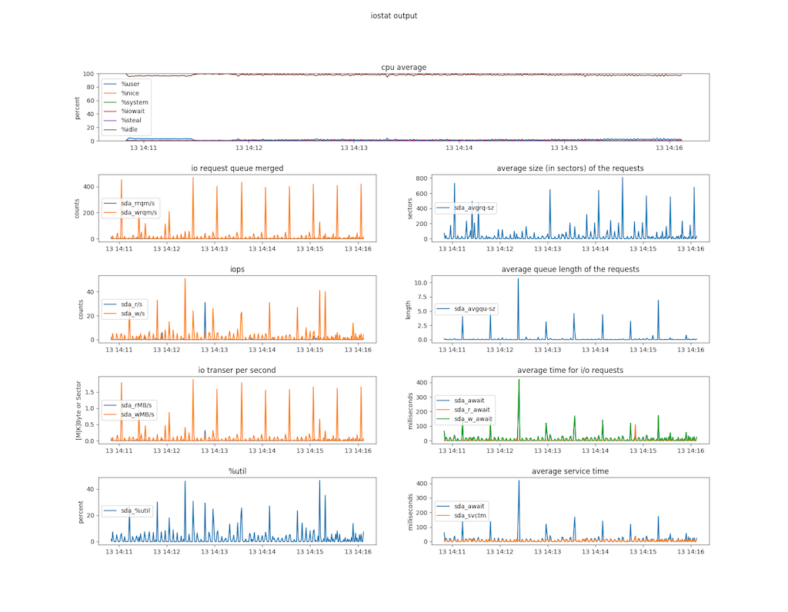

# iostat-tool

parse and structuralize iostat output

## Requirements

* Python >= 3.4
  * iostat-tool uses [asyncio](https://docs.python.org/3/library/asyncio.html) to monitor output of iostat
* [Matplotlib](https://matplotlib.org/)
* Support output of iostat for Linux only
  * `iostat` command needs `-t` argument to get timestamp, and `-ymxt 1` arguments are recommended
```bash
$ man iostat
  -t  Print the time for each report displayed. The timestamp format may depend on the value of the S_TIME_FORMAT environment variable (see below).
```

## How to install

Create virtualenv to install `iostat-tool`.

```bash
$ mkdir virtualenvs
$ virtualenv -p python3 virtualenvs/iostat-tool
$ source virtualenvs/iostat-tool/bin/activate
(iostat-tool) $
```

Install `iostat-tool` package from the repository.

```bash
(iostat-tool) $ git clone https://github.com/t2y/iostat-tool.git
(iostat-tool) $ cd iostat-tool
(iostat-tool) $ python setup.py develop
```

Confirm `iostat-cli` works as below.

```bash
(iostat-tool) $ iostat-cli --help
usage: iostat-cli [-h] [--backend BACKEND] [--data DATA]
                  [--fig-output FIGOUTPUT] [--fig-size FIGSIZE]
                  [--output OUTPUT] [--disks DISKS [DISKS ...]]
                  [--since SINCE] [--until UNTIL] [-v] [--version]
                  {csv,monitor,plot} ...

positional arguments:
  {csv,monitor,plot}

optional arguments:
  -h, --help            show this help message and exit
  --backend BACKEND     set backend for matplotlib, use TkAgg to monitor in
                        the foreground
  --data DATA           set path to iostat output file
  --fig-output FIGOUTPUT
                        set path to save graph
  --fig-size FIGSIZE    set figure size
  --output OUTPUT       set path to save output of iostat
  --disks DISKS [DISKS ...]
                        set disk name in iostat
  --since SINCE         set since datetime, format: yyyymmddHHMISS
  --until UNTIL         set until datetime, format: yyyymmddHHMISS
  -v, --verbose         set verbose mode
  --version             show program version
```

## How to use

This is sample image rendered by matplotlib.



### there is already an iostat.ouput as data file

* show all subplots of /dev/sda and cpu average

```bash
(iostat-tool) $ iostat-cli --data tests/fixtures/sample_iostat.output --disk sda --fig-output my-iostat.png plot
(iostat-tool) $ file my-iostat.png
my-iostat.png: PNG image data, 1800 x 1400, 8-bit/color RGBA, non-interlaced
```

* show any subplots of /dev/sda and cpu average
  * filter `io_rqm` and `iops` with `--subplots`

```bash
(iostat-tool) $ iostat-cli --data tests/fixtures/sample_iostat.output --disk sda --fig-output my-iostat.png plot --subplots io_rqm iops
```

* show any range of date time
  * filter since 2018-06-13 14:11:00 with `--since`
  * filter until 2018-06-13 14:11:30 with `--until`

```bash
(iostat-tool) $ iostat-cli --data tests/fixtures/sample_iostat.output --disk sda --fig-output my-iostat.png --since 20180613141100 --until 20180613141130 plot --subplots await svctm
```

* show vertical lines into graph
  * 2018-06-13 14:11:10 and 2018-06-13 14:11:20 with `--vlines`

```bash
(iostat-tool) $ iostat-cli --data tests/fixtures/sample_iostat.output --disk sda --fig-output my-iostat.png --since 20180613141100 --until 20180613141130 plot --subplots await svctm --vlines 20180613141110 20180613141120
```

### run iostat and logging the output

* monitor iostat command running
  * almost the same as `iostat -yxmt 1 | tee my-iostat.log`

```bash
(iostat-tool) $ iostat-cli --output my-iostat.log --fig-output my-scatter.png monitor --iostat-args "-yxmt 1"
...
06/13/2018 10:11:07 PM
avg-cpu:  %user   %nice %system %iowait  %steal   %idle
           0.94    0.00    0.03    0.00    0.00   99.03

Device:         rrqm/s   wrqm/s     r/s     w/s    rMB/s    wMB/s avgrq-sz avgqu-sz   await r_await w_await  svctm  %util
sda               0.00     0.00    0.00    0.00     0.00     0.00     0.00     0.00    0.00    0.00    0.00   0.00   0.00

06/18/2018 10:11:08 PM
avg-cpu:  %user   %nice %system %iowait  %steal   %idle
           0.16    0.00    0.06    0.00    0.00   99.78
...

(Ctrl + C) # stop to run iostat
```

```bash
(iostat-tool) $ file my-iostat.log my-scatter.png
my-iostat.log:  ASCII text
my-scatter.png: PNG image data, 1800 x 1300, 8-bit/color RGBA, non-interlaced
```

NOTE: Saving `my-scatter.png` is experimental feature when io-stat terminated, so it might fails to save the figure.
